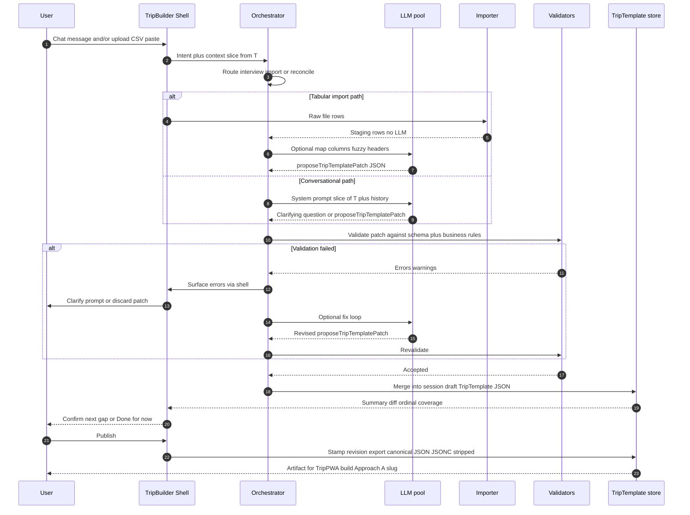

# Architecture Design Specification — TripBuilder (Agentic)

**Document ID:** ADS-TripBuilder  
**Status:** Draft (brainstorm)  
**Audience:** Architect, builders of TripTemplate pipeline, Cursor automation consumers  

---

## 1. Purpose and scope

This document proposes an architecture for **TripBuilder** as an **agentic system**: one or more **LLM-driven agents** interact with a user (and optionally **batch inputs** such as CSV or pasted text) to **iteratively populate** a **TripTemplate** JSON artifact.

**In scope:**

- Conversational elicitation, structured extraction, validation feedback loops, ingestion of unstructured and tabular snippets, and convergence toward a publishable TripTemplate.

**Explicitly deferred:**

- Detailed JSON Schema for TripTemplate (assumed frozen elsewhere).  
- TripPWA code generation (separate artifact; consumes published TripTemplate).  
- Hosted multi-tenant SaaS economics (local-first emphasis here).

---

## 2. Design goals

| Goal | Implication |
|------|---------------|
| **Iterative authoring** | Session state survives multi-turn refinement; partial TripTemplates are valid work products. |
| **Grounding in canonical output** | Every agent action either reads or proposes **diffs against TripTemplate**—not ephemeral prose as the sole source of truth. |
| **Low API cost option** | Primary recommendation path: **open-weight models run locally** (user hardware permitting). |
| **Multimodal inputs (later)** | Architecture leaves room for tickets/screenshots/maps without mandating multimodal MVP. |
| **Auditable edits** | User approves merges; catastrophic hallucinations constrained by validators and optional human diff review. |

---

## 3. Conceptual architecture

TripBuilder behaves as an **elicitation and synthesis loop**:

1. **User intent** (chat + optional uploads) enters the orchestrator.  
2. **Orchestrator** chooses sub-behaviors (ask next question, parse CSV snippet, reconcile dates, propose `DayPlan` update).  
3. **Structured proposals** target **TripTemplate** subtrees (`meta`, `content.dayPlans[date]`, `lodgingStays`, …).  
4. **Validators** (deterministic rules + schema) accept, reject with reasons, or auto-fix trivial issues.  
5. **Committed state** increments **session TripTemplate draft** (+ optional changelog).  
6. **Publish** emits versioned TripTemplate JSON for downstream TripPWA / Cursor codegen.

High-level containment:

```
┌─────────────────────────────────────────────────────────────────┐
│                     TripBuilder Shell (optional)               │
│  Web UI │ CLI │ IDE extension │ API — same core behind them      │
└─────────────────────────────┬───────────────────────────────────┘
                              │
┌─────────────────────────────▼───────────────────────────────────┐
│                  Session / Trip State Store                      │
│  draft TripTemplate │ conversation log │ ingestion artifacts     │
└─────────────────────────────┬───────────────────────────────────┘
                              │
┌─────────────────────────────▼───────────────────────────────────┐
│                     Agent Orchestrator                           │
│  policy (when to ask vs propose) │ tool routing │ stop criteria │
└─┬───────────┬───────────┬───────────┬───────────┬───────────────┘
  │           │           │           │           │
  ▼           ▼           ▼           ▼           ▼
┌────┐   ┌─────────┐ ┌──────────┐ ┌─────────┐ ┌─────────────┐
│ LLM │   │ Retrieval│ │ Validators│ │Importer │ │ Explanation │
│ pool│   │ (RAG)    │ │ (schema + │ │(CSV/Text│ │ to user UI  │
│     │   │ optional │ │  business) │ │ parsers) │ │             │
└────┘   └─────────┘ └──────────┘ └─────────┘ └─────────────┘
```

### 3.1 End-to-end sequence (Mermaid)

Iterative session: conversational or tabular path converges on a validated draft, then publish. `TripTemplate` artifacts for TripPWA live under `TravelPWA/trip-templates/` (see `TripTemplate.v1.reference.jsonc` and `examples/`).



---

## 4. Agentic decomposition

Rather than one monolithic “chat GPT,” split responsibilities into **roles** (implementable as one model with prompting, multiple models with routing, or a small state machine):

| Agent role | Responsibility | Typical triggers |
|------------|----------------|------------------|
| **Interviewer** | Asks the next minimal question; tracks coverage of required TripTemplate areas. | Gaps after schema scan; user says “what’s missing?” |
| **Extractor** | Turns raw text / email paste / OCR into structured candidate edits. | User pastes itinerary from email |
| **Tabular Mapper** | Maps CSV/XLS-like rows onto `lodgingStays`, `transportSegments`, `scheduledItems`. | Upload or paste spreadsheet fragment |
| **Scheduler** | Suggests `dayPlans[date]` structure, segments (morning/afternoon/evening), ordering. | “Plan day 6” command |
| **Reconciler** | Detects conflicts (double-booked trains, lodging gap, date out of trip range); proposes merges. | After bulk import |
| **Copy editor** | Tightens language in `callouts` / `richPanels` without altering facts—or flags uncertainty. | User requests polish |

**Orchestration policy (design choice):**

- **Single-agent with tool calling:** One frontier-capable instruct model invokes tools (`propose_patch`, `validate`, `summarize_gap`). Easiest to prototype; weaker models may drift.  
- **Router + specialists:** Lightweight model or rules route to specialist prompts/skills (better for smaller local LLMs).

---

## 5. Interaction modes

### 5.1 Chat-first (guided)

Natural language drives the session. The orchestrator maintains a **coverage checklist** derived from TripTemplate schema tiers (must-have vs optional).

UX patterns:

- **Propose → confirm:** Agent shows bullet summary then “Apply / Edit / Discard.”  
- **Focus mode:** “Let’s fill transport only”—reduces branching.  
- **Diff mode (power users):** JSON Patch or sectional diff before merge.

### 5.2 Form-assisted (hybrid)

Structured panels (dates, travelers, lodging table) synchronize **bidirectionally** with TripTemplate—the agent reads form state as ground truth on each turn.

### 5.3 Batch-first

User supplies CSV/export; TripBuilder responds with:

- Parsing report (rows accepted, ambiguous, rejected).  
- **Preview patch** affecting named `dayPlans` keys.  
- Follow-up chat only where mapping confidence is below threshold.

### 5.4 Stop criteria

Session can end when:

- **Mandatory fields** validated;  
- User explicitly publishes;  
- Agent proposes “no actionable gaps”; user acknowledges.

---

## 6. Tooling boundary (deterministic vs LLM)

**Deterministic components** (avoid LLM for correctness-critical paths):

- JSON Schema validation (structure).  
- IANA timezone checks; ISO date normalization; duplication of keyed `dayPlans`.  
- Id uniqueness for `places`, `scheduledItem` IDs.  
- CSV parsing **syntax** (delimiters, header detection).

**LLM-suited:**

- Turning messy prose into **`scheduledItems`** candidates.  
- Inferring **`place`** candidates from shorthand (“Hilton Tokyo Shinjuku”) with **confidence score**—confirmation required before registry commit.  
- Natural-language Q&A over the current draft (“what hotel on Apr 2?”)—read-only retrieval from JSON.

LLM proposals should flow through **`proposeTripTemplatePatch`** payloads that validators ingest—not raw free-write into the canonical file without checks.

---

## 7. Ingestion: CSV / text snippets

Design a **staging area** (`ingestion.stagingRecords[]`) detached from canonical TripTemplate until promoted:

1. **Parse** file or paste → typed rows (no LLM).  
2. **Map** columns to domain with help from LLM only when column headers are nonstandard (user confirms mapping table once per file).  
3. **Join** to existing `registry.places` by fuzzy match + user pick.  
4. **Promote** to `transportSegments` / `lodgingStays` / embedded `scheduledItems` via patch.

**Ambiguity handling:** never silent merge; surface **N candidate interpretations** with one recommended default.

---

## 8. Memory, context, and long sessions

| Concern | Approach |
|---------|----------|
| **Context window** | Keep **full TripTemplate** outside the prompt; inject **section slices** (`meta`, one `DayPlan`, `transportSegments`) as needed (RAG-lite by path). |
| **Conversation history** | Summarize aged turns into a **session synopsis** retained across rolls; preserve user commitments (“we never take redeyes”). |
| **Versioning** | Optional `revision` increments on publish; drafts carry `draftId`. |

---

## 9. Security, privacy, and cost posture

Running **locally**:

- Sensitive bookings and confirmation codes remain on device if cloud sync is disabled.  
- Eliminates **per-token SaaS billing** from the inference path (capital cost shifts to GPU/DRAM).  

Trade-offs:

- Model capability vs hardware.  
- User must patch models for safety issues; supply-chain trust on weights.

---

## 10. Recommended open-weight / open-source LLM families (local inference)

Selections assume **instruction-tuned**, **Apache 2 / permissive-ish** weights where practical; licensing must be verified per exact checkpoint **before production**. Grouped by realistic **VRAM / unified memory** bands (approximate—quantization shifts boundaries).

### 10.1 Edge / laptops without discrete GPU (~8 GB unified RAM or light GPU)

| Model family | Roles | Notes |
|--------------|--------|-------|
| **Llama 3.2 Instruct** (1B–3B) | Router summarization; tiny extraction with heavy validation | Needs strict JSON schema coaxing |
| **Phi-4 / Phi-3.5** (Mini / Medium) | Interviewer stubs; rewriting | Strong reasoning per size for MS ecosystem |
| **Qwen 2.5 Instruct** (0.5B–3B) | Lightweight tasks | Good multilingual if trips non-English |
| **SmolLM2**, **LlamaEdge**-tier | Fallback only | Prefer validation-heavy pipeline |

These tiers **should not** solely own autonomous patch application without deterministic gates.

### 10.2 Mid-tier local (16–24 GB VRAM **or** 32 GB unified with aggressive quant)

| Model family | Roles | Notes |
|--------------|--------|-------|
| **Llama 3.1 Instruct** (8B) | Solid single-agent tool use with schema | Popular ecosystem; quantized Q4/Q5 typical |
| **Mistral** / **Magistral** / **Mixtral 8×7B** (quant) | Alternate backbone for EU-friendly stacks | Mixtral needs VRAM discipline |
| **Qwen 2.5 Instruct** (7B–14B) | Extraction + multilingual | Often strong structured output hygiene |
| **Gemma 2 Instruct** (9B–27B quantized) | General assistant | Good compact option |

**Recommended “default backbone” band for hobbyist/agentic TripBuilder:** **7B–9B instruct** quantized + validators, or **14B** if VRAM allows (fewer rework turns).

### 10.3 High-tier local / workstation (≥48 GB VRAM or aggressive multi-GPU)

| Model family | Roles | Notes |
|--------------|--------|-------|
| **Llama 3.1 Instruct** (70B Q4) | Single model end-to-end agent + planner | Heavy |
| **Qwen 2.5 / Qwen 2.5-Coder** (32B–72B quant) | Large-context synthesis; tabular reasoning | Coder variants help JSON Patch discipline |
| **Mixtral 8×22B** (quant) | High quality alternative | Power draw / VRAM |
| **DeepSeek** family (e.g. R1 distill, V3-class where licensed) | Deep reasoning for conflict reconciliation | Check license + export rules for your jurisdiction |

Use these when **reducing human correction time** matters more than electricity.

### 10.4 Serving runtimes (non-exhaustive)

| Runtime | When to use |
|---------|-------------|
| **Ollama** | Fastest path to local chat + OpenAI-compatible API for prototypes |
| **llama.cpp** / **GGUF** | Maximum control, CPU + GPU hybrid |
| **vLLM** | High throughput on capable Linux + NVIDIA |
| **LM Studio** | Desktop UX for experimentation |
| **MLX** (Apple Silicon) | Efficient on M-series Macs |

### 10.5 Practical agent stack recommendation

- **Router / cheap model** (tiny): intent classification (“import_csv” vs “chitchat”).  
- **Worker** (8B–14B): structured extraction & patch authoring under JSON schema constraint.  
- **Optional heavyweight** on demand: reconcile complex multi-day conflicts (“run Reconciler on demand”).

Never skip **deterministic validators** regardless of tier.

---

## 11. Operational quality attributes

| Attribute | Mechanism |
|-----------|-----------|
| **Reliability** | Schema validators; business rules; idempotent patches |
| **Observability** | Log prompts, tool calls, patches (sanitize PII if logging) |
| **Testability** | Golden fixtures: pasted emails → expected patch; fuzzy column CSV → confirmed mapping |
| **Accessibility** | UI mode agnostic — voice later via same orchestrator |

---

## 12. Migration path toward TripBuilder emitting TripPWA

Phase A: TripBuilder publishes **TripTemplate JSON** → external codegen (manual or Cursor).

Phase B: TripBuilder invokes **frozen codegen pipeline** (“build TripPWA bundle”) locally.

Phase C: **Embedded preview** serves static TripPWA pointing at draft template (sandbox).

Dependencies: stable `schemaVersion` and repeatable build.

---

## 13. Open decisions

1. **Patch format:** JSON Merge Patch vs JSON Patch vs whole-section replace.  
2. **Conflict policy:** time-of-item wins vs author-declared `daySegment` when both exist.  
3. **Concurrency:** multi-user TripBuilder vs single-seat only.  
4. **Secrets:** confirmation codes stripped from logs default? (recommended yes)

---

## 14. References (conceptual)

- **TripTemplate v1 annotated reference:** `TravelPWA/trip-templates/TripTemplate.v1.reference.jsonc`  
- **Example fixtures (TripPWA test builds):** `TravelPWA/trip-templates/examples/*.jsonc`  
- TripTemplate design threads: keyed `content.dayPlans[YYYY-MM-DD]`, intra-day ordering, segment bands.  
- TripPWA consumes published TripTemplate; does not redefine schema.

---

## Document history

| Version | Date | Author | Notes |
|---------|------|--------|-------|
| 0.1 | 2026-05-01 | Brainstorm capture | Agentic TripBuilder + local OSS model guidance |
| 0.2 | 2026-05-02 | Approved iteration | §3.1 Mermaid sequence; pointers to TripTemplate artifacts |

---

*End of ADS-TripBuilder*
